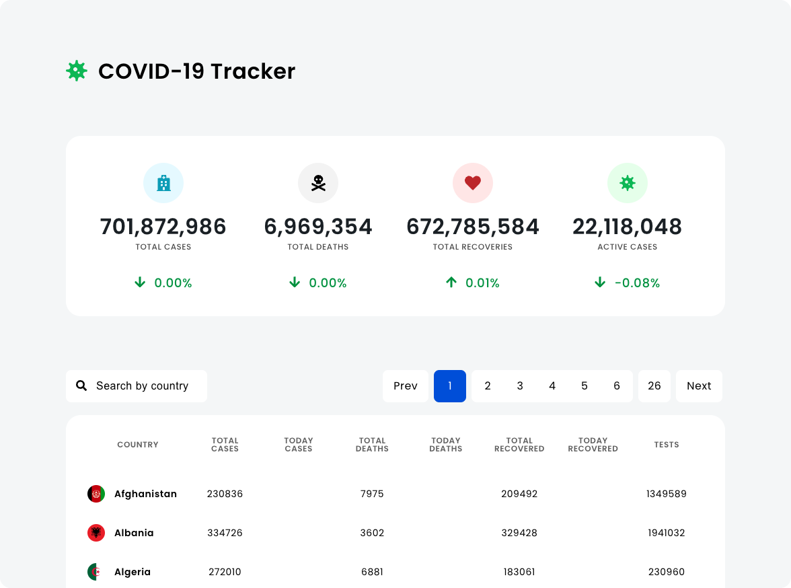

# Covid-19 Tracker

This hobby project is a React-based COVID-19 Tracker that provides real-time updates on the global pandemic. The tracker utilizes React components and integrates with the Disease API to fetch and display the latest statistics.

**Used frontend tools and host:**

